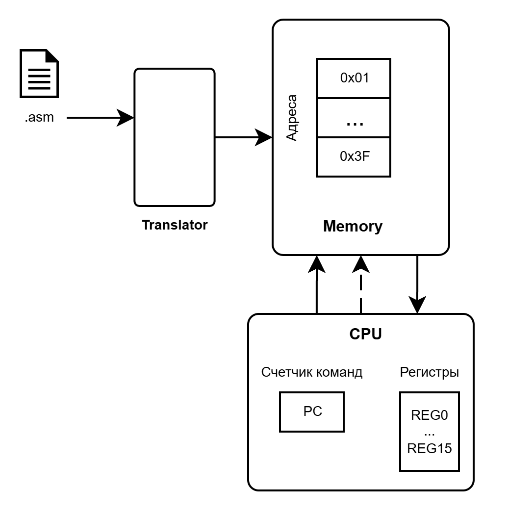
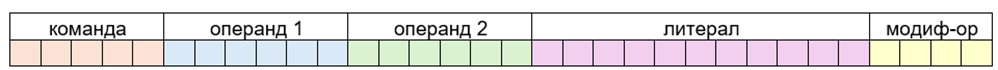

## Эмулятор CPU 

Программа эмуляции процессора с набором инструкций над регистрами и памятью.



Основные характеристики:
- Архитектура Фон-Неймана (данные и команды в одной памяти)
- 2х адресные команды
- длина команды 32 бит
- память 64 ячейки по 32 бит = 2048 бит = 256 байт
- Флаги: равенство нулю (ZF), флаг знака (SF), переполнение (CF)

## Структура команд

Команды имеют фиксированную длину (32 бита). Структура команды представлена на рисунке:



### Распределение битов

* *[32-28] - Код команды* - Старшие 5 бит, определяющие текушую выполняемую команду

* *[27-22] - Операнд 1* - 6 бит, определяющие значение операнда 1 (тип операнда описывается модификатором)

* *[21-16] - Операнд 2* - 6 бит, определяющие значение операнда 2 (тип операнда описывается модификатором)

* *[15-5] - Литерал* - 11 бит, определяюшие значение литерала

* *[4-1] - Модификатор доступа* - Младшие 4 бита, определяющие тип операндов и наличие литерала в команде

## Виды команд
|Тип команд|Вид в ассемблере||
|-|-|-|
|двухадресные|*MOV REG1, REG2*|destination, source|
|одноадресные|*JMP [REG1]*|destination|
|безадресные|*HLT*|-| 

### Таблица команд
|Номер|Синтаксис|Описание*|Номер|Синтаксис|Описание|
|-|-|--|-|-|---|
|00001|ADD|Прибавить к destination source|01110|MOV|Запись данных в destination из source |
|00010|SUB|Вычесть из destination source|10100|JC|Переход pc к метке, если флаг переноса установлен |
|00011|MUL|Умножить destination на source|10101|JNC|Переход pc к метке, если флаг переноса не установлен |
|00100|DIV|Разделить destination на source |10110|JS|Переход pc к метке, если флаг знака установлен|
|00101|INC|Увеличить значение в destination на 1|10111|JNS|Переход pc к метке, если флаг знака не установлен|
|00110|DEC|Уменьшить значение в destination на 1|11000|JZ|Переход pc к метке, если флаг нуля установлен|
|00111|CMP|Сравнить destination и source**|11001|JNZ|Переход pc к метке, если флаг нуля не установлен|
|01000|AND|Поразрядное И destination и source|11010|JMP|Безусловный переход к метке памяти|
|01001|OR|Поразрядное ИЛИ destination и source|11011|LOOP|Переход цикла к метке памяти***|
|01010|NOT|Поразрядное НЕ destination
|01011|XOR|Поразрядное ИСКЛЮЧАЮЩЕЕ ИЛИ destination и source|11111|HLT|Переход pc в конец памяти (завершение работы)|

(*) Все команды, кроме CMP записывают результат в destination

(**) Операция проводит вычитание из destination source. Если результат = 0, то поднимается ZF. Если результат < 0, то поднимается SF. Если результат > 0, то опускается SF. 

(***) Инструкция цикла: переход pc к ячейке памяти, если в регистре C(cycle, REG2) значение больше 0я. При переходе значение в регистре С уменьшается на 1

## Модификатор доступа

Ниже в таблице приведена работа модификатора доступа. REG.id - номер регистра, Mem.id - номер ячейки памяти

Варианты обращений:
- ```REG0 - прямой доступ в регистр```
- ```[16] - прямой доступ в ячейку памяти```
- ```[REG0] - адрес памяти, записанный в регистре```
- ```[REG0+4] - адрес памяти в регистре + фиксированное смещение```
- ```[REG0+REG1] - адрес памяти и смещение из регистров```

|Модификатор|Вид в asm|Destination|Source||
|-|-|-|-|-|
|||op1|op2|liter|
|0000|MOV REG0, REG1|0|1||
|0001|MOV REG0, 1000|0||1000|
|0010|MOV REG0, [16]|0|16||
|0011|MOV REG0, [REG1]|0|1|
|0100|MOV REG0, [REG1+4]|0|1|4|
|0101|MOV REG0, [REG1+REG2]|0|1|2|
|0110|-|-|-|
|0111|JS 8|8||
|1000|MOV [16], REG1|16|1|
|1001|MOV [REG0], REG1|0|1|
|1010|MOV [REG0+4], REG1|0|1|4|
|1011|MOV [REG0+REG1], REG2|0|2|1|
|1100|MOV [16], 1000|16||1000|
|1101|MOV [REG0], 1000|0||1000|
|1110|MOV [REG0+4],1000|0|4|1000|
|1111|MOV [REG0+REG1], 1000|0|1|1000|

## Пример программы

Ниже приведен пример программы для сортировки массива пузрьковым алгоритмом. В папке asm есть примеры: поиска максимума в массиве, суммирования элементов массива, свертки массива (элементы нового массива являются произведением элементов исходных массивов с одинаковыми индексами)
```asm
.data
array: 5, 4, 3, 6, 1
size: 5

.text
	MOV REG2, [size]      ; размер массива в регистр цикла
	DEC REG2	          ; счет идет с 0я
	MOV REG3, array       ; адрес на массив в REG3 (первый элемент)

outer_loop:		          ; подготовка к циклу
	MOV REG4, 0	          ; i
	MOV REG5, 1	          ; i+1
	MOV REG8, 0	          ; REG8 - флаг того что обмен был произведен

inner_loop:
	MOV REG6, [REG3+REG4] ; array[i], i=REG4
	MOV REG7, [REG3+REG5] ; array[i+1], i+1=REG5
	CMP REG6, REG7	      ;
	JS  no_swap           ; if array[i] <= array[i+1]
	MOV [REG3+REG4], REG7 ; обмен элементов
	MOV [REG3+REG5], REG6 ; обмен элементов
	MOV REG8, 1	          ; REG8 - флаг того что обмен был произведен

no_swap:
	INC REG4 	          ; (i)++
	INC REG5 	          ; (i+1)++
	CMP REG4, REG2	      ; до конца ли массива прошли i < size?
	JS  inner_loop	      ; i < size
	CMP REG8, 0	          ; были обмены?
	JZ done		          ; если нет, то завершаем
	LOOP outer_loop       ; идем дальше по циклам

done:
	HLT		      
```
